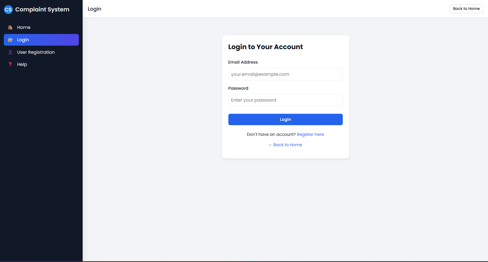
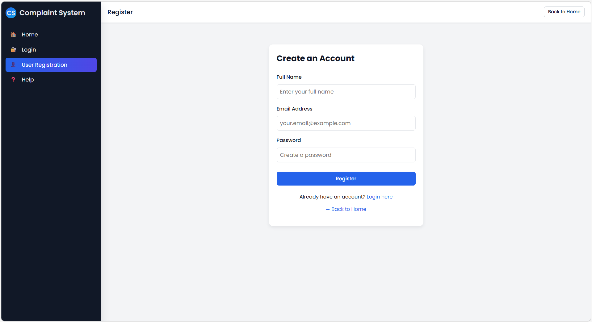
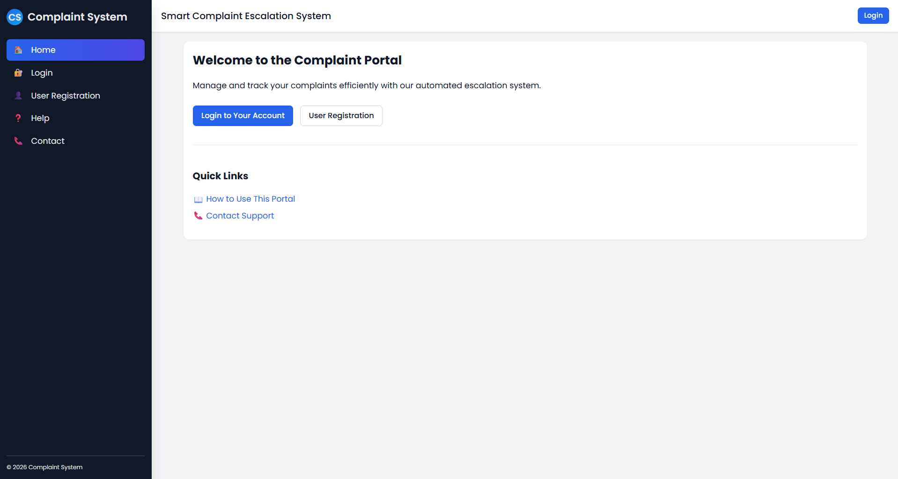
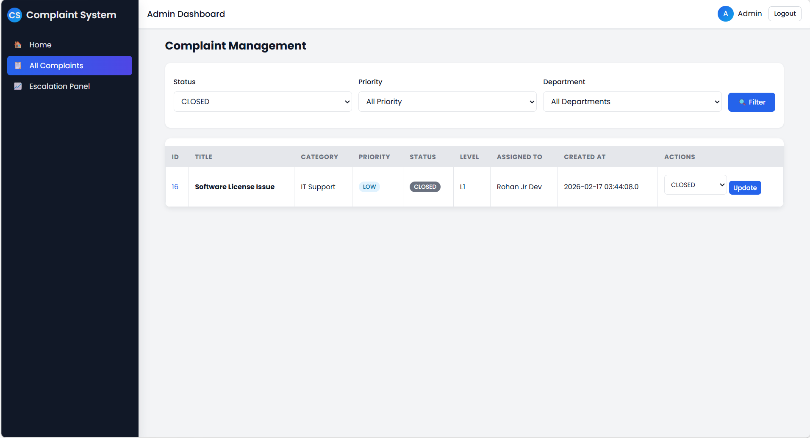
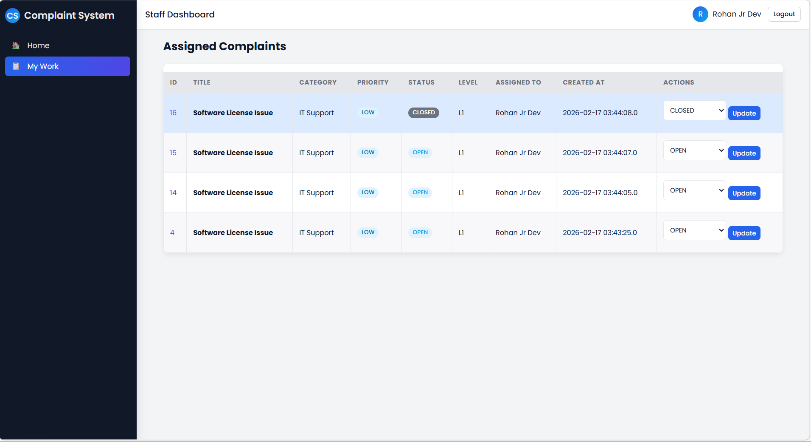
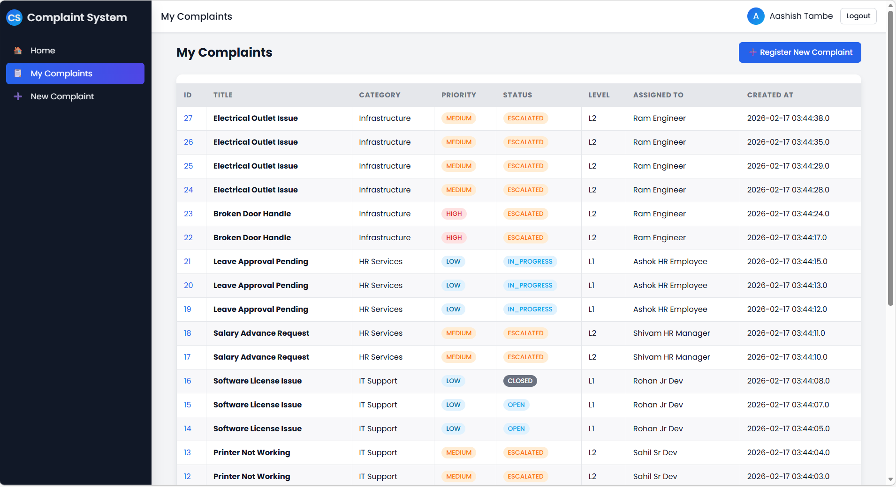

# 🚀 Smart Complaint Escalation System

A Java-based web application built using **Servlets and JSP** to manage complaints efficiently and automatically escalate them based on SLA (Service Level Agreement) rules.

---

## 📌 Overview

The **Smart Complaint Escalation System** helps organizations track, manage, and escalate complaints automatically when they are not resolved within a specified time.

---

## 📸 Screenshots

### 🔐 Login Page


---

### 🔐 User Registration Page


---

### 📊 Dashboard


---

### 📝 Complaint Form


---

### 🏢 Admin Panel


---

### 📈 Staff Panel


---

### 🏢 User Panel


---

## 🛠️ Tech Stack

* 💻 **Backend:** Java 11 (Servlets, JSP)
* 🌐 **Server:** Apache Tomcat 9
* 🗄️ **Database:** MySQL 8.0
* 🔗 **Connectivity:** JDBC (MySQL Connector 8.1.0)
* 📦 **Build Tool:** Maven

---

## ⚙️ Setup Instructions

### 1️⃣ Clone the Repository

```bash
git clone https://github.com/your-username/your-repo-name.git
cd your-repo-name
```

---

### 2️⃣ Create Database

Open MySQL and run:

```sql
CREATE DATABASE complaint_system;
USE complaint_system;
```

Create required tables:

* users
* departments
* complaint_categories
* complaints
* escalation_rules
* complaint_history
* notifications

---

### 3️⃣ Configure Database

Edit the file:

```
src/main/java/com/complaintsystem/config/DBConnection.java
```

Update your database credentials:

```java
String url = "jdbc:mysql://localhost:3306/complaint_system";
String username = "your_username";
String password = "your_password";
```

---

### 4️⃣ Build the Project

Run the following command:

```bash
mvn clean package
```

After build, you will get:

```
target/ComplaintSystem.war
```

---

### 5️⃣ Deploy to Tomcat

1. Copy `.war` file to:

```
Tomcat/webapps/
```

2. Start Tomcat server

---

### 6️⃣ Run the Application

Open your browser and go to:

```
http://localhost:8080/ComplaintSystem/
```

---

## 🔥 Features

* 📝 Complaint Registration
* 🏢 Department Assignment
* ⏱️ SLA-based Escalation
* 🔔 Notification System
* 📊 Complaint Tracking
* 🧾 Complaint History

---

## ⚡ Escalation Logic

* **EscalationJob**
  Checks complaint deadlines and escalates if required

* **EscalationScheduler**
  Runs escalation job periodically using a timer

---

## 📂 Project Structure

```
src/
 ├── controller/
 ├── dao/
 ├── model/
 ├── config/
 ├── util/
 ├── jsp/
```

---

## 🚧 Future Improvements

* Convert project to **Spring Boot**
* Add **REST APIs**
* Improve UI/UX
* Add authentication & role-based access
* Deploy on cloud (AWS / Railway)

---

## 👨‍💻 Author

**Aashish Tambe**,**Ayush Jarhad**

---

## ⭐ Support

If you like this project, please ⭐ the repository!

---


